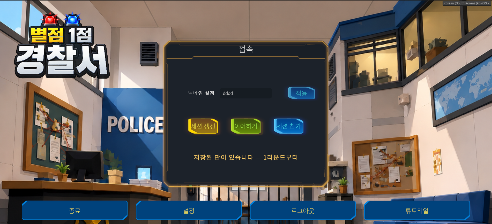
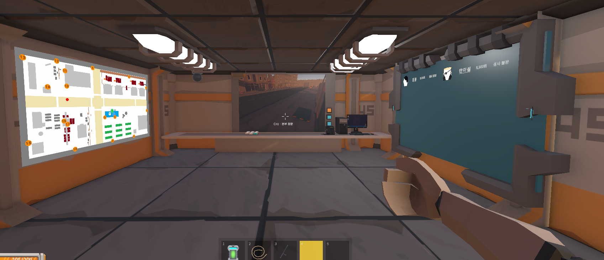
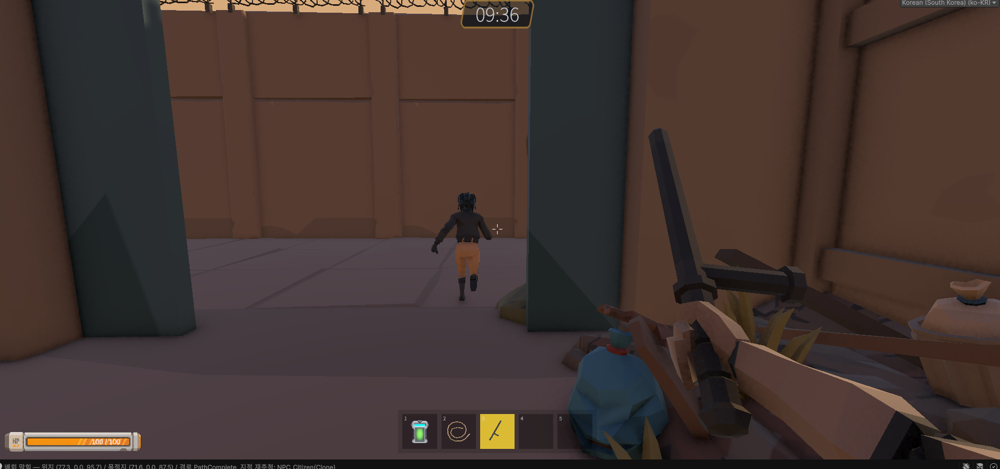
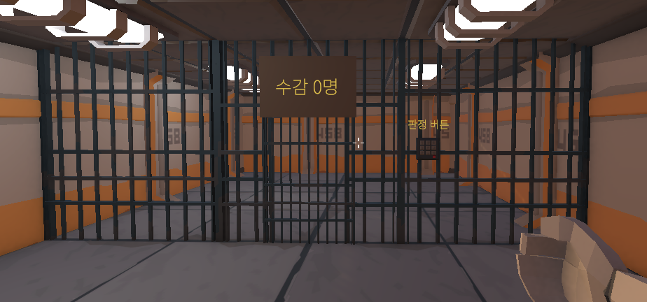

# 별점 1점 경찰서

**3~6인 비대칭 협동 추리 게임.** 사이버펑크 도시의 로봇 경찰이 되어 **본부(관제)** 와 **현장(수사)** 으로
나뉘어, 무전으로만 소통하며 용의자를 검거한다.



> 이 저장소는 4인 팀 프로젝트 [hyunjin0814/undercover-team4-project](https://github.com/hyunjin0814/undercover-team4-project)의 **포크**이며, **김준영의 포트폴리오 열람용**입니다.
> 아래 문서는 본인이 최초 작성 · 담당한 범위로 한정해 적었습니다.

---

## 프로젝트 개요

| | |
|---|---|
| **기간** | 2026.07.08 – 09.04 (2개월) |
| **팀 구성** | 4인 |
| **엔진 · 언어** | Unity 6000.3.15f1 / C# |
| **네트워크** | Netcode for GameObjects · UGS Relay·Lobby · Vivox |
| **기술 스택** | URP · Input System · AI Navigation(NavMesh) · ScriptableObject · UniTask |
| **코드 규모** | 스크립트 536개 / 98,946줄 |

---

## 게임 소개

본부는 CCTV와 수배 명단을 보고, 현장은 거리를 뛴다. **한쪽이 가진 정보를 다른 쪽이 볼 수 없어**,
모든 시스템이 «무전으로 말이 오가야 풀린다»는 조건을 만족해야 했다. 이 제약이 아래 시스템 설계를 전부 규정했다.

| 본부 (관제) | 현장 (수사) |
|---|---|
| CCTV 전환 · 수배 명단 · 미니맵 · 원격 문 개방 | 추적 · 제압 · 검거 · 유치장 인계 |

| 본부 관제실 | 현장 추적 | 유치장 |
|---|---|---|
|  |  |  |

<sub>현장 컷 하단의 로그는 NPC 경로 탐색 디버그 표시입니다.</sub>

---

## 담당 범위 — 김준영

커밋 **1,237 / 2,632건 (47%)** 으로 4인 중 최다 · 최초 작성 스크립트 **305 / 536개 (57%)**

### NPC AI — 상태 머신 (13,646줄)

한 덩어리가 되기 쉬운 NPC 코드를 **상태 · 관심사 · 튜닝값** 세 축으로 쪼갰다.

- **상태 클래스 19종**을 `NpcStateMachine`이 갈아 끼운다 (Idle / Walk / Flee / Chase / Resist / Escorted / Jailed …)
- **상태별 Config ScriptableObject 11종**으로 튜닝값 분리 — 밸런싱에 코드 수정이 필요 없다
- `NpcController` **3,973줄을 관심사별 partial 15분할** (Custody / Escort / Health / Knockback / Rope / Stun …)
- 추격을 **4개 모듈로 분해** — `ChaseSteering` · `ChaseReachability` · `ChaseTargeting` · `ChaseAmbush`.
  NavMesh 위에서 여럿이 협공하고, 길목을 막는 매복까지 성립시켰다

### 돌발 이벤트 9종 (9,704줄)

이벤트를 하나씩 하드코딩하면 매니저가 종류를 전부 알게 된다. **규격을 먼저 세우고** 아홉 종을 같은 방식으로 꽂았다 —
신규 이벤트를 추가할 때 **매니저 코드를 건드리지 않는다.**

```
ISuddenEvent · ISuddenEventProvider
 ├─ 직접 구현 4종 ── AbductionEvent(납치) · DeviceBlackoutEvent(정전)
 │                   BombChaseEvent(폭탄) · JailbreakEvent(탈옥)
 └─ SpawnedNpcEventBase 5종 ── FactionRevengeEvent · PickpocketEvent
                               StreetThugEvent · SmugglerCourierEvent · StreakerEvent

IRoundWeather (별도 규격) ── FogEvent · SnowEvent · LightningEvent
```

매니저가 종류를 모른 채로도 꺼낼 수 있게 제네릭 조회를 뒀다 — `GetEvent<T>()`

### 추격 폭탄 (2,232줄) — 만든 걸 버리고 다시 만든 자리

처음에는 본부 매뉴얼을 무전으로 받아 선을 자르는 **해체 퍼즐형**(#232)이었다.
1인칭에서 자기 몸에 붙어 오는 폭탄의 선을 읽어 불러주는 그림이 성립하지 않는다고 판단해,
**퍼즐 계층(`BombPuzzle`·`BombWire`·`BombManual`)을 전부 제거하고 추격형으로 재설계**했다 (#399, 2026-08-05).
본부의 역할은 규칙 판독에서 **위치 유도**(미니맵 · CCTV)로 옮겨 갔다.

```
Emerging ──▶ Dormant ──▶ Armed ──▶ Exploded
상자가 2초    사람을 찾아   14m 안에      제한시간 종료
들썩이며 예고  배회(시계 정지) 들면 30초
```

- **해체도 밀어내기도 없다** — 대응은 달아나기뿐
- 배회 **4.2 m/s** · 추격 **5.5 m/s** · 플레이어 걷기 **5 m/s** — 무장하면 뛰어야만 거리가 벌어진다
- `BombDevice`는 상태 기계·수명·권위 판정만 들고, 추격은 `BombChaseDriver`, 폭발은 `BombBlast`에 위임 (#768)

### 검거 · 유치장 파이프라인 (서버 권위)

오판정 하나가 라운드 결과를 뒤집기 때문에 판정을 **단일 출처**로 모았다.

```
ArrestJudge ─▶ ArrestVerdict ─▶ CustodyRouter ─▶ JailIntake ─▶ JailLock
검거 성립 판정   정당 / 오인 확정   신병 경로 분기   유치장 인수   수감 · 잠금
```

- 판정을 클라이언트에 두지 않았다 — 서버 권위로 계산하고 클라이언트는 받기만 한다
- 무고한 시민을 잡으면 팀 자금이 깎인다. **판정이 한 곳이라 페널티 규칙도 한 곳**에 붙는다
- 유치장을 독립 설비(`JailZone` · `JailDoor` · `JailRoom`)로 분리해 **탈옥 이벤트가 같은 설비를 재사용**한다
- 판정은 서버, 연출은 각 피어가 스스로 재생 — 늦게 들어온 피어가 지난 연출을 받지 않는다

---

## 아키텍처 규칙

4인이 두 달간 10만 줄을 쌓는 동안 구조가 무너지지 않게, **리뷰에서 기계적으로 판정할 수 있는 형태로**
규칙을 적어 `docs/architecture.md`에 유지했다.

| | |
|---|---|
| **R1** | 전역 매니저 접근은 `App` 파사드 단일 경로 |
| **R2** | 신규 싱글톤 금지 |
| **R4** | 새 매니저 = 베이스 상속 + 실행 순서 명시 + `App` 등록 |
| **R7** | 씬 전환은 `App.LoadScene`만 — 세션 동기화 자동 분기 |
| **R8** | 매니저 참조 캐싱 금지 — 읽기 프로퍼티로 |

규칙만 적으면 예외가 생길 때 문서가 죽는다. **의도적 예외를 사유와 이슈 번호까지 붙여 표로 관리**했고,
기재 없는 예외는 위반으로 봤다.

---

## 최적화

| 이슈 | 내용 |
|---|---|
| **#961** | 런타임 핫패스의 `FindObjectsByType`을 정적 레지스트리로 교체(호출부 10곳). 등록·해제를 `OnEnable`/`OnDisable`에 둬 기존 «비활성 제외» 집합과 맞췄다 |
| **#717** | 트래픽 차량이 클라이언트 화면에서만 끊겨 보이던 스터터 — 위치를 서버 틱에서 재계산 |
| **#692 · #768 · #313** | Overlap 버퍼에 래그돌 본이 담겨 한 명이 콜라이더 12개를 먹던 문제 — 본 제외 · 중복 제거 · 버퍼 확대 |
| **#557 · #951 · #782** | 반복 로그를 구간당 한 번으로, 강수 없는 라운드에는 마스크를 굽지 않도록 |

## 리팩토링

| 이슈 | 내용 |
|---|---|
| **#970** | 스크립트를 도메인 하위 폴더로 재구성 |
| **#972 · #973** | 죽은 코드와 복사된 로직 제거 |
| **#503 · #502** | `NpcController` · NPC 애니메이션을 부품으로 분리 |
| **#967** | 플레이어 튜닝 수치를 Config ScriptableObject로 이관 |

리팩토링도 이슈로 등록해 브랜치를 팠다 — `refactor/972-973-dead-and-duplicate-code`

---

## 개발 환경

- **Unity `6000.3.15f1`** 로 열 것 (Unity Hub)
- 빌드 · 테스트는 Unity Editor에서 수행. 멀티플레이 동시 테스트는 **Multiplayer Play Mode**로 가상 플레이어를 띄운다
- 게임 디자인 정본은 [`docs/GDD.md`](docs/GDD.md), 코드 구조 정본은 [`docs/architecture.md`](docs/architecture.md)

---

<sub>수치는 저장소 git 이력(`git shortlog`, `--diff-filter=A`)과 실제 파일 라인 수에서 산출 · 2026-09-06 기준.<br>
4인 팀 프로젝트이며, 이 문서에 적은 시스템은 본인이 최초 작성 · 담당한 범위로 한정했습니다.</sub>
